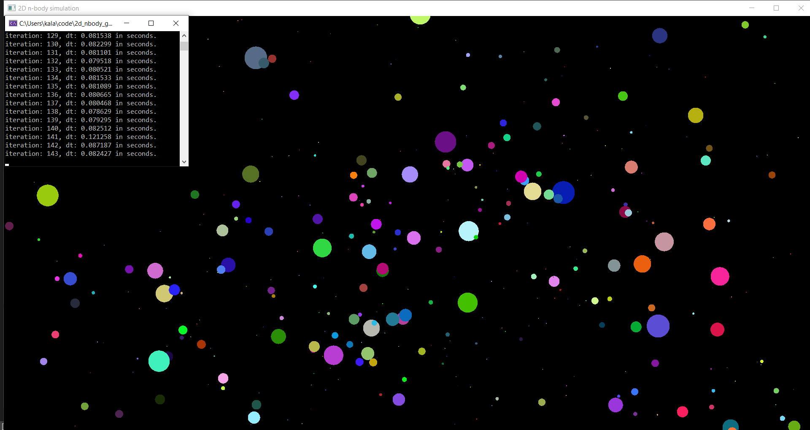

# 2d_nbody_gravity_sim

# 3rd-party libaries
The [SFML](https://github.com/SFML/SFML) library is used for the rendering and window creation.

# Screenshots
15.04.2023 - 500 particles - initial leap-frog-physics implementation

